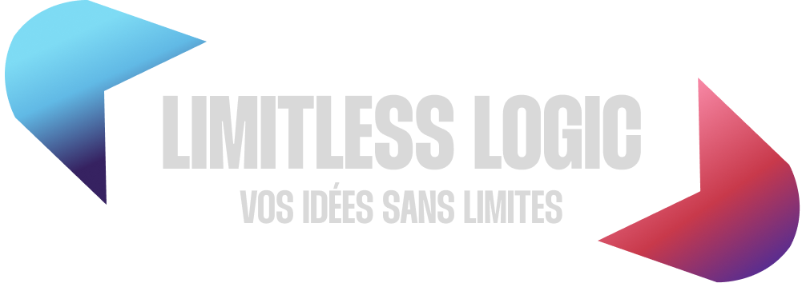

 

# 📊Projects

### Rosea Checkout

**Description:**  
Rosea Checkout is a comprehensive solution designed to streamline the process of order management and checkout in various types of stores, particularly suitable for environments like restaurants. This project features a desktop application for in-store use, a frontend application for client-side interactions, and an interface with thermal printers for efficient receipt printing.

 

### Rosea IoT

#### See : [Dashboard](https://github.com/Logarithmique51/-IoT--dashboard-app) / [MQTT Broker](https://github.com/Logarithmique51/-IoT--mqtt-broker) / [Embedded program](https://github.com/Logarithmique51/-IoT--embedded-system)

**Description:**  
Rosea IoT is an innovative Internet of Things (IoT) solution featuring a self-hosted MQTT server. It is designed to run on all ESP modules, providing robust functionality including auto-discovery of devices, seamless communication, and efficient management of IoT devices.
 
 

# 💻 Tech Stack

**Frontend**  
 

**Backend**  

**Desktop**  

**Mobile**  

  

**Embedded**  

**Server**  

**Serverless / CMS / Database**  

**Design**  

**Tools & Other**  

 
 

# 💫 About Me

🔭 I’m currently working on  " Rosea Checkout "
